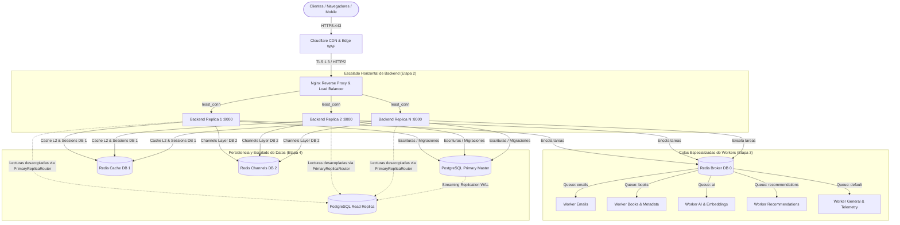

# Estrategia de Escalabilidad y Optimización de Rendimiento (Fase 30)

Este documento detalla la arquitectura de escalabilidad, el plan de crecimiento en 4 etapas y las directrices de tuning de infraestructura para **MyBookConnect**, en conformidad con la **Sección 35 del Roadmap**.

---

## 1. Filosofía Arquitectónica: Crecimiento Basado en Datos Reales

> *"Solo cuando los datos reales indiquen necesidad. No introducir microservicios prematuramente."*

MyBookConnect adopta el enfoque de un **Monolito Modular Altamente Optimizado**. Esta estrategia elimina la sobrecarga operativa, los fallos de red inter-servicio, la complejidad de transacciones distribuidas y la duplicación de modelos propios de los microservicios, permitiendo alcanzar más de 100.000 usuarios activos mediante escalado horizontal sin fricción.



---

## 2. Las 4 Etapas de Escalabilidad

### 2.1. Etapa 1: Base Sólida y Sin Estado (Single Node Consolidado)
- **Componentes:** 1 instancia de Backend ASGI (Daphne) + 1 Worker Celery polivalente + 1 Base de datos PostgreSQL con `pgvector` + 1 Instancia Redis.
- **Capacidad estimada:** Hasta 5.000 usuarios activos diarios (DAU) y 50 peticiones por segundo (RPS).
- **Invariante:** El backend debe ser estrictamente **stateless** (sin estado local en disco ni sesiones en memoria del proceso). Las subidas se almacenan en volúmenes dedicados o almacenamiento de objetos, y las sesiones en Redis.

---

### 2.2. Etapa 2: Escalado Horizontal del Backend
Cuando la utilización de CPU del backend supere el 65% de forma sostenida o la latencia p95 supere los 200 ms:

1. **Balanceo de Carga L7 en Nginx:**
   El archivo `frontend/nginx.conf` define el bloque `upstream` con la directiva `least_conn` para repartir peticiones hacia las instancias con menos conexiones activas:
   ```nginx
   upstream django_cluster {
       least_conn;
       server backend_1:8000 max_fails=3 fail_timeout=10s;
       server backend_2:8000 max_fails=3 fail_timeout=10s;
       server backend_3:8000 max_fails=3 fail_timeout=10s;
   }
   ```
2. **Escalado Dinámico:**
   En Docker Compose / Swarm / Kubernetes:
   ```bash
   # Escalar a 4 réplicas de backend
   docker compose up -d --scale backend=4 --no-recreate
   ```
3. **Consistencia de WebSockets:**
   Las conexiones WebSockets (`/ws/`) se mantienen sincronizadas entre réplicas gracias al `RedisChannelLayer` centralizado en Redis (DB 2).

---

### 2.3. Etapa 3: Separación Granular de Workers Celery
Para evitar que tareas de cómputo intensivo (cálculo de embeddings vectoriales de IA) o tareas con latencia de red variable (servidores SMTP externos) bloqueen tareas críticas de sincronización de catálogo, las colas se aíslan formalmente en `settings.py`:

| Cola | Responsabilidad / Tareas Asignadas | Concurrencia Recomendada | Perfil de Recursos |
| :--- | :--- | :--- | :--- |
| **`emails`** | `send_transactional_email_task`, `send_notification_email_task` | Concurrencia alta (I/O Bound, 4–8) | Memoria baja, prioridad máxima |
| **`books`** | `enrich_book_task`, `download_cover_task`, `refresh_author_task`, `recalculate_book_rating_task`, `import_books_by_author_task` | Concurrencia media (I/O Bound, 4) | Memoria moderada |
| **`ai`** | `generate_book_embedding_task`, `batch_reindex_embeddings_task` | Concurrencia controlada (CPU Bound, 1–2) | Memoria alta, límite de tareas para evitar leaks |
| **`recommendations`** | `precompute_trending_task`, `precompute_user_recommendations_task` | Concurrencia baja (2) | Cómputo matemático en background |
| **`default`** | `record_analytics_event_task`, eventos de telemetría, auditoría | Concurrencia estándar (2–4) | I/O asíncrono ágil |

#### Arranque de Workers Aislados:
```bash
# Worker exclusivo para correos (respuesta inmediata a usuarios)
celery -A mybookconnect worker -l INFO -Q emails -c 4 -n worker_emails@%h

# Worker exclusivo para IA y vector embeddings
celery -A mybookconnect worker -l INFO -Q ai -c 2 --max-tasks-per-child=500 -n worker_ai@%h

# Worker para libros y recomendaciones
celery -A mybookconnect worker -l INFO -Q books,recommendations -c 4 -n worker_catalog@%h

# Worker para tareas generales
celery -A mybookconnect worker -l INFO -Q default -c 2 -n worker_default@%h
```

---

### 2.4. Etapa 4: Optimización y Tuning de Persistencia y Entrega

#### 1. PostgreSQL y Réplicas de Lectura (`PrimaryReplicaRouter`)
MyBookConnect implementa `mybookconnect.db_routers.PrimaryReplicaRouter`:
- **Lecturas (`db_for_read`):** Se enrutan a la base de datos `replica` si está definida en `DATABASES['replica']`.
- **Escrituras (`db_for_write`) y Migraciones (`allow_migrate`):** Se dirigen estrictamente a la base de datos primaria `default`.
- **Connection Pooling:** Uso de `CONN_MAX_AGE = 60` para reutilizar conexiones TCP existentes. Ante saturación (>250 conexiones simultáneas), interponer **PgBouncer** en modo `transaction pooling`.

#### 2. Tuning de `pgvector`
Para catálogos superiores a 50.000 libros:
- **Índice HNSW (Hierarchical Navigable Small World):**
  Excelente para búsquedas vectoriales con alta precisión y baja latencia (<5 ms).
  ```sql
  CREATE INDEX idx_book_embedding_hnsw ON books_bookembedding 
  USING hnsw (embedding vector_cosine_ops) 
  WITH (m = 16, ef_construction = 64);
  ```
- **Índice IVFFlat:**
  Alternativa ligera en consumo de RAM cuando el catálogo supera el millón de registros.
  ```sql
  CREATE INDEX idx_book_embedding_ivfflat ON books_bookembedding 
  USING ivfflat (embedding vector_cosine_ops) 
  WITH (lists = 100);
  ```

#### 3. Tuning de Redis
- **Separación Lógica de Datos:**
  - DB 0: Celery Broker & Task Results.
  - DB 1: Caché de aplicación L2 (vistas, fragmentos, consultas).
  - DB 2: Django Channels Layer (WebSockets en tiempo real).
- **Políticas de Memoria:**
  - Configurar `maxmemory-policy allkeys-lru` para la base de caché.
  - Habilitar compresión de claves y AOF con `appendfsync everysec`.

#### 4. CDN y Object Storage
- **Media Files:** Almacenamiento en S3 / Cloudflare R2 con nombres de archivo basados en hash SHA-256 inmutable.
- **Cabeceras de Caché:** `Cache-Control: public, max-age=31536000, immutable`.
- **Compresión Nginx:** Gzip y Brotli para activos estáticos empaquetados por Vite (`.js`, `.css`, `.svg`).

---

## 3. Matriz de Decisiones y Umbrales de Escalado

| Métrica Monitoreada | Umbral Normal | Umbral de Alerta | Acción de Escalado Requerida |
| :--- | :--- | :--- | :--- |
| **CPU del Backend** | < 50% | > 70% durante 5 min | Añadir réplicas de backend (Etapa 2) |
| **Tiempo de Respuesta p95** | < 100 ms | > 250 ms | Escalar backend o activar réplica de lectura (Etapa 4) |
| **Longitud de Cola Celery `emails`** | 0–10 | > 50 | Aumentar concurrencia en worker de emails |
| **Longitud de Cola Celery `ai`** | 0–5 | > 100 | Escalar worker de IA con límite de memoria |
| **Conexiones activas PostgreSQL** | < 40 | > 80 | Activar PgBouncer y pooling de conexiones |
| **Hit Rate de Caché Redis** | > 85% | < 70% | Revisar TTLs e invalidaciones prematuras de caché |
