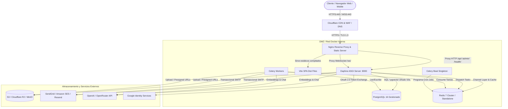

# Guía Integral de Preparación de Producción y Hardening (Fase 29)

Esta guía documenta la arquitectura de producción, las medidas de hardening de seguridad, la resiliencia operativa y los procedimientos estándar para el despliegue de **MyBookConnect**.

---

## 1. Topología y Arquitectura de Infraestructura



---

## 2. Dominio y DNS

Para apuntar el dominio de producción a los servidores de MyBookConnect:

| Tipo | Nombre de Host | Destino / Valor | Finalidad |
| :--- | :--- | :--- | :--- |
| **A** | `@` (o `mybookconnect.com`) | `203.0.113.10` (IP Servidor) | Dominio raíz, SPA y endpoints web |
| **A** | `www` | `203.0.113.10` | Redirección canónica a `@` |
| **A** | `api` | `203.0.113.10` | Dominio de API REST/GraphQL (opcional si usa subruta) |
| **CNAME** | `media` | `bucket.r2.cloudflarestorage.com` / CloudFront | CDN de archivos multimedia y avatares |
| **TXT** | `@` | `v=spf1 include:sendgrid.net ~all` | Registro SPF para correo saliente |
| **TXT** | `_dmarc` | `v=DMARC1; p=reject; rua=mailto:dmarc@mybookconnect.com` | Política DMARC de máxima protección |
| **TXT** | `s1._domainkey` | Clave pública proporcionada por SendGrid/SES | Firma criptográfica DKIM |

---

## 3. Certificados TLS 1.3 con Let's Encrypt / Certbot

### Obtención inicial de certificados
El contenedor Nginx expone el endpoint `/.well-known/acme-challenge/` mapeado al volumen `/var/www/certbot`:

```bash
docker run -it --rm --name certbot \
  -v "/etc/letsencrypt:/etc/letsencrypt" \
  -v "/var/lib/letsencrypt:/var/lib/letsencrypt" \
  -v "/var/www/certbot:/var/www/certbot" \
  certbot/certbot certonly --webroot \
  --webroot-path=/var/www/certbot \
  --email admin@mybookconnect.com --agree-tos --no-eff-email \
  -d mybookconnect.com -d www.mybookconnect.com
```

### Renovación Automática (systemd timer o cron)
Configurar cron en el nodo anfitrión para renovación cada semana con recarga sin corte:
```bash
0 3 * * 1 docker run --rm -v "/etc/letsencrypt:/etc/letsencrypt" -v "/var/www/certbot:/var/www/certbot" certbot/certbot renew --webroot -w /var/www/certbot --quiet && docker compose -f docker-compose.prod.yml exec frontend nginx -s reload
```

---

## 4. Reverse Proxy Nginx & Endurecimiento de Cabeceras

El archivo de configuración de Nginx (`frontend/nginx.conf`) aplica:

1. **Protocolos Seguros:** TLSv1.2 y TLSv1.3 con curvas elípticas modernas y ciphers PFS (Perfect Forward Secrecy).
2. **HSTS:** `Strict-Transport-Security: max-age=31536000; includeSubDomains; preload`.
3. **Anti-Clickjacking y MIME Sniffing:** `X-Frame-Options: DENY`, `X-Content-Type-Options: nosniff`.
4. **Política de Referrer:** `Referrer-Policy: strict-origin-when-cross-origin`.
5. **Content Security Policy (CSP):**
   ```nginx
   add_header Content-Security-Policy "default-src 'self'; script-src 'self' https://accounts.google.com https://apis.google.com; connect-src 'self' wss://* https://* https://accounts.google.com; img-src 'self' data: https: blob:; style-src 'self' 'unsafe-inline' https://fonts.googleapis.com; font-src 'self' https://fonts.gstatic.com data:; frame-src https://accounts.google.com; object-src 'none'; base-uri 'self';" always;
   ```
6. **Permissions-Policy:** Bloqueo de APIs de sensores no requeridas:
   ```nginx
   add_header Permissions-Policy "camera=(), microphone=(), geolocation=(), payment=(), usb=()" always;
   ```
7. **Rate Limiting:** Zonas de limitación en Nginx (`limit_req_zone`) para mitigar DDoS y ataques de fuerza bruta en `/api/v1/auth/` y `/admin/`.
8. **Compresión:** Gzip y Brotli para CSS, JS y JSON.

---

## 5. Endurecimiento de Seguridad en Django (Backend)

La configuración `backend/mybookconnect/settings.py` implementa el estándar estricto cuando `DEBUG=False`:

- **Terminación SSL en Proxy Inverso:**
  ```python
  SECURE_PROXY_SSL_HEADER = ('HTTP_X_FORWARDED_PROTO', 'https')
  ```
  Evita redirecciones infinitas de tipo 301 asegurando que Django identifique correctamente las peticiones HTTPS que llegan a través de Nginx.
- **Redirección HTTPS y HSTS:**
  `SECURE_SSL_REDIRECT = True`
  `SECURE_HSTS_SECONDS = 31536000`
  `SECURE_HSTS_INCLUDE_SUBDOMAINS = True`
  `SECURE_HSTS_PRELOAD = True`
- **Cookies Seguras:**
  `SESSION_COOKIE_SECURE = True`
  `SESSION_COOKIE_HTTPONLY = True`
  `SESSION_COOKIE_SAMESITE = 'Lax'`
  `CSRF_COOKIE_SECURE = True`
  `CSRF_COOKIE_HTTPONLY = False` *(Permite que el cliente JS envíe la cookie CSRF según el estándar Django)*
  `CSRF_COOKIE_SAMESITE = 'Lax'`
- **Hosts y Orígenes Confiables:**
  `ALLOWED_HOSTS` obtenido estrictamente desde entorno.
  `CORS_ALLOWED_ORIGINS` y `CSRF_TRUSTED_ORIGINS` limitados a los dominios oficiales HTTPS.
- **Ruta de Administración Ofuscada:**
  Configurable mediante `DJANGO_ADMIN_URL` (ej. `gestion-mbc-panel-secure/` en lugar de `admin/`).

---

## 6. Base de Datos PostgreSQL Gestionada

1. **Versión:** PostgreSQL 16 con extensión `pgvector` activada.
2. **Cifrado en Tránsito:** Conexión con `sslmode=require` / `sslmode=verify-full`.
3. **Backup Automático y PITR:**
   - Snapshots diarios con retención mínima de 30 días.
   - WAL Archiving continuo para recuperación Point-in-Time con RPO ≤ 1 hora.
4. **Pool de Conexiones:**
   - `CONN_MAX_AGE = 600` para reutilizar conexiones en Daphne y Celery.
   - PgBouncer intermedio en caso de alta concurrencia (>200 clientes simultáneos).

---

## 7. Redis Gestionado (Caché, Channels y Celery)

1. **Persistencia Híbrida:** RDB snapshots periódicos + AOF (`appendonly yes`, `appendfsync everysec`).
2. **Políticas de Desalojo:** `maxmemory-policy allkeys-lru` para la base de caché.
3. **Seguridad:** Autenticación obligatoria mediante `requirepass` con token de alta entropía.
4. **Separación de Bases de Datos Lógicas:**
   - DB 0: Celery Broker & Results.
   - DB 1: Django Cache.
   - DB 2: Django Channels Layer (WebSockets).

---

## 8. Workers Celery en Producción

Configuración para alta estabilidad y prevención de fugas de memoria:

```bash
celery -A mybookconnect worker \
  -l INFO \
  -c 4 \
  --max-tasks-per-child=1000 \
  --time-limit=300 \
  --soft-time-limit=240
```

- `--max-tasks-per-child=1000`: Recicla procesos worker periódicamente para evitar crecimiento indebido de memoria.
- `Celery Beat` se ejecuta como **singleton estricto** en un único contenedor o servicio para evitar disparos duplicados de tareas periódicas.

---

## 9. Almacenamiento Multimedia (S3 / Cloudflare R2 / MinIO)

1. **Aislamiento:** Los archivos multimedia de los usuarios (portadas de libros, avatares, fotos de perfil) no se sirven desde el sistema de archivos local de los contenedores efímeros.
2. **Backend:** Compatible con S3 (`django-storages` o backend S3 compatible en `MEDIA_STORAGE_BACKEND`).
3. **CDN:** Cloudflare o CloudFront delante del bucket con caché de cabeceras inmutables (`Cache-Control: public, max-age=31536000, immutable`).
4. **Validación de Subidas:**
   - Validación de magic bytes para formatos permitidos (`image/jpeg`, `image/png`, `image/webp`).
   - Límite máximo de tamaño por archivo: 5 MB para portadas y 2 MB para avatares.

---

## 10. Proveedor SMTP Transaccional

1. Integración vía SendGrid, Mailgun, Amazon SES o Resend.
2. `REQUIRE_EMAIL_VERIFICATION = True` en producción para mitigar bots y spam.
3. Cola asíncrona: Los envíos de correos de bienvenida, verificación y notificaciones se ejecutan a través de tareas Celery con reintentos exponenciales.

---

## 11. Monitorización, APM y Logs Centralizados

1. **APM / Error Tracking (Sentry):**
   - Captura excepciones 500 no controladas y rendimiento de transacciones en backend y frontend.
2. **Métricas (Prometheus / Grafana):**
   - Endpoints `/metrics` expuestos con autenticación básica.
   - Monitorización de CPU, RAM, latencia de base de datos, tamaño de colas Celery y tasa de errores HTTP.
3. **Logs Estructurados:** Formato JSON con campos `timestamp`, `level`, `request_id`, `user_id` y `message`.

---

## 12. Backup y Disaster Recovery (RPO ≤ 1h, RTO ≤ 4h)

- **RPO (Recovery Point Objective):** ≤ 1 hora mediante copias automáticas continuas de WAL de base de datos y snapshots de volúmenes.
- **RTO (Recovery Time Objective):** ≤ 4 horas mediante scripts de restauración automatizados (`scripts/backup/restore_backup.sh`).
- Cifrado de backups en reposo mediante AES-256 (`BACKUP_ENCRYPTION_KEY`).
- Copia off-site geográficamente redundante hacia bucket secundario en región alternativa.

---

## 13. Rate Limiting de Defensa en Profundidad

1. **Capa 1 (WAF / Nginx):** Limitación por IP para mitigar ráfagas excesivas y ataques volumétricos.
2. **Capa 2 (Django Ratelimit):**
   - Endpoints de autenticación (`/api/v1/auth/login/`, `/api/v1/auth/register/`): 5 peticiones/minuto por IP.
   - Endpoints de IA y generación semántica: 20 peticiones/minuto, 100/hora por usuario.

---

## 14. Auditoría de Dependencias y Vulnerabilidades

Comandos de auditoría obligatorios antes de cada pase a producción:

```bash
# Backend
docker compose exec backend pip audit

# Frontend
cd frontend && pnpm audit --prod
```

---

## 15. Script Pre-Flight Check de Producción

Antes de dirigir tráfico DNS hacia una nueva versión, ejecutar el script de verificación pre-vuelo:

```bash
docker compose -f docker-compose.prod.yml exec backend bash scripts/production/preflight_check.sh
```

El script valida:
1. `DEBUG=0` y `SECRET_KEY` segura.
2. Conexión y estado de la base de datos PostgreSQL.
3. Ausencia de migraciones pendientes (`showmigrations`).
4. Comprobaciones de seguridad nativas de Django (`check --deploy`).
5. Conectividad y respuesta de Redis Caché.
6. Sondas de salud `/health/live` y `/health/ready` respondiendo 200 OK.
7. Existencia y compilación de archivos estáticos.

---

## 16. Plan de Rollback sin Downtime

En caso de fallo crítico detectado tras el despliegue:

1. **Reversión de Contenedores:**
   ```bash
   docker compose -f docker-compose.prod.yml down
   # Restaurar etiqueta o hash del commit anterior
   git checkout <commit_hash_estable>
   docker compose -f docker-compose.prod.yml up -d --build
   ```
2. **Reversión de Migraciones de Base de Datos (si aplica):**
   ```bash
   # Revertir aplicación a la migración previa
   docker compose -f docker-compose.prod.yml exec backend python manage.py migrate <app_name> <migration_number_anterior>
   ```
3. **Restauración desde Snapshot (si hubo corrupción de datos):**
   ```bash
   ./scripts/backup/restore_backup.sh /app/backups/mybookconnect_prod_snapshot_latest.sql.enc
   ```
4. **Verificación de Salud Posterior:**
   ```bash
   curl -fk https://localhost/health/ready
   ```
