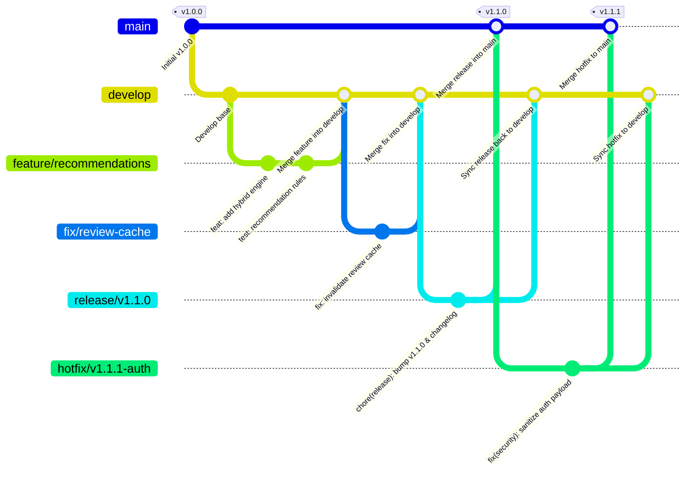

# Estrategia de Ramas (Git Branching Strategy)

Este documento define el modelo oficial de ramificación, ciclo de vida de ramas y directrices de integración para **MyBookConnect**, basado en un flujo GitFlow moderno adaptado a integración continua (CI/CD).

---

## 1. Ramas Principales (Long-lived Branches)

El repositorio mantiene dos ramas de vida permanente con protección de escritura directa:

| Rama | Propósito | Entorno Asociado | Estabilidad | Despliegue |
| :--- | :--- | :--- | :--- | :--- |
| `main` | Código de producción en vivo. Cada merge debe corresponder a un tag SemVer (`vX.Y.Z`). | Producción | Máxima / Estable | Despliegue continuo a producción tras pasar CI |
| `develop` | Rama de integración activa para la siguiente versión. Recibe features completadas. | Staging / Pre-producción | Estable para pruebas | Despliegue continuo a entorno de staging |

> [!IMPORTANT]
> Está terminantemente prohibido hacer `git push --force` o realizar commits directos sobre `main` o `develop`. Toda integración debe realizarse a través de Pull Requests (PRs) con revisión y pipeline de CI en verde.

---

## 2. Ramas de Soporte y Trabajo (Supporting Branches)

Las ramas de soporte tienen una vida limitada y se eliminan una vez integradas en su rama destino:

### 2.1. `feature/*`
- **Origen:** `develop`
- **Destino:** `develop`
- **Nomenclatura:** `feature/<nombre-descriptivo-kebab-case>`
- **Ejemplos:**
  - `feature/recommendation-engine`
  - `feature/reading-goals-gamification`
  - `feature/dark-mode-theme`
- **Propósito:** Desarrollo de nuevas funcionalidades o mejoras sustanciales.

### 2.2. `fix/*` o `bugfix/*`
- **Origen:** `develop`
- **Destino:** `develop`
- **Nomenclatura:** `fix/<descripcion-del-bug>`
- **Ejemplos:**
  - `fix/review-rating-average-rounding`
  - `fix/chat-message-scroll-position`
- **Propósito:** Corrección de defectos detectados durante las pruebas o desarrollo activo en `develop`.

### 2.3. `refactor/*`
- **Origen:** `develop`
- **Destino:** `develop`
- **Nomenclatura:** `refactor/<area-reestructurada>`
- **Ejemplos:**
  - `refactor/book-service-modularization`
  - `refactor/auth-context-zustand`
- **Propósito:** Mejoras de arquitectura, optimización de rendimiento o limpieza de deuda técnica sin alterar el comportamiento funcional visible.

### 2.4. `hotfix/*`
- **Origen:** `main`
- **Destino:** `main` **Y** `develop`
- **Nomenclatura:** `hotfix/<vX.Y.Z-descripcion>`
- **Ejemplos:**
  - `hotfix/v1.0.1-jwt-security-patch`
  - `hotfix/v1.0.2-fix-db-connection-leak`
- **Propósito:** Corrección urgente de bugs críticos en producción que no pueden esperar al ciclo de release regular. Se crea desde `main`, se valida, se fusiona en `main` con un nuevo tag SemVer de parche, y se fusiona inmediatamente de vuelta en `develop` para evitar regresiones.

### 2.5. `release/*`
- **Origen:** `develop`
- **Destino:** `main` **Y** `develop`
- **Nomenclatura:** `release/v<X.Y.Z>`
- **Ejemplos:**
  - `release/v1.0.0`
  - `release/v1.1.0`
- **Propósito:** Congelación de código (feature freeze), preparación de notas en `CHANGELOG.md`, bumping de versiones y pruebas de humo previas al despliegue en producción.

---

## 3. Diagrama de Flujo del Ciclo de Vida



---

## 4. Políticas de Fusión e Integración

### 4.1. Rebase en ramas de trabajo local
Antes de solicitar la integración a `develop`, sincroniza tu rama con los últimos cambios de `develop` mediante rebase para resolver conflictos de forma limpia:

```bash
git checkout feature/mi-feature
git fetch origin
git rebase origin/develop
```

### 4.2. Merge sin Fast-Forward (`--no-ff`) hacia `develop` y `main`
Para preservar la historia explícita de qué commits pertenecen a qué funcionalidad o release, los merges hacia `develop` y `main` deben utilizar `--no-ff`:

```bash
git checkout develop
git merge --no-ff feature/mi-feature -m "feat(books): integrar motor de recomendaciones (#42)"
```

---

## 5. Checklist para Pull Requests (PRs)

Antes de fusionar cualquier rama de trabajo a `develop`:
- [ ] La rama parte de la versión más reciente de `origin/develop`.
- [ ] Todos los commits siguen el estándar de [Conventional Commits](https://www.conventionalcommits.org/es/).
- [ ] No se incluyen secretos, archivos temporales ni `.env` locales.
- [ ] La suite de pruebas de backend pasa al 100%: `docker compose exec backend pytest`.
- [ ] Los linters de backend están limpios: `docker compose exec backend ruff check`.
- [ ] El frontend no presenta errores de tipos ni linter: `npm run typecheck` y `npx vitest run`.
- [ ] Las nuevas vistas o endpoints cuentan con tests asociados y documentación en OpenAPI si corresponde.
