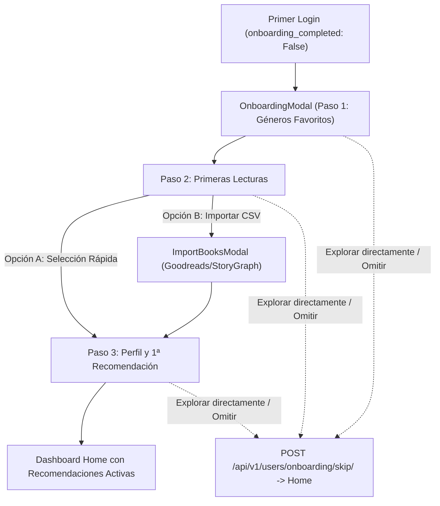

# Experiencia de Bienvenida y Onboarding del Lector (Fase 19)

## 1. Resumen Ejecutivo
La **Fase 19** implementa una experiencia de incorporación (*onboarding*) ágil, estética y sin fricciones para nuevos usuarios en **MyBookConnect**.

El objetivo es lograr que un nuevo lector entienda el valor de la plataforma en **menos de dos minutos**, personalice sus afinidades temáticas, agregue o importe sus primeras lecturas y reciba su **primera recomendación personalizada visible** en tiempo real.

---

## 2. Principios de Diseño de Producto

1. **Agilidad sin barreras:**
   - **Regla de oro del Roadmap:** Evitar tutoriales largos, popups forzados y pantallas obligatorias que bloqueen la navegación sin sentido.
   - El usuario siempre dispone de la opción *"Explorar directamente"* para omitir el flujo con un solo clic.
2. **Solución del Problema de Arranque en Frío (*Cold Start*):**
   - En plataformas sociales de lectura, un usuario nuevo sin historial no tiene suficientes datos para recomendaciones colaborativas.
   - Al seleccionar sus categorías favoritas (`favorite_categories`), el motor de recomendaciones pondera estas temáticas con peso prioritario (1.0), entregando recomendaciones altamente relevantes desde el segundo cero.
3. **Integración con Bibliotecas Existentes:**
   - Se ofrece acceso directo al importador universal de CSV (`ImportBooksModal`) para lectores que ya cuentan con estanterías en Goodreads o StoryGraph.

---

## 3. Arquitectura del Flujo en Tres Pasos



### Paso 1: ¿Qué te apasiona leer?
- Cuadrícula de chips interactivos con iconos temáticos y recuento de libros por categoría.
- Selección multitópico (Ciencia Ficción, Novela Negra, Fantasía, Romance, Historia, etc.).

### Paso 2: Tus Primeras Lecturas
- Selector rápido de libros populares/destacados con botones *"Leído"* o *"Por leer"*.
- Banner para importar directamente desde exportaciones CSV de Goodreads o StoryGraph.

### Paso 3: Perfil y Primera Recomendación
- Biografía breve de presentación comunitaria (opcional).
- Cálculo en tiempo real de la primera recomendación personalizada explicada (*"Basado en tu interés por Ciencia Ficción"*).

---

## 4. Endpoints de la API

### 4.1. `GET /api/v1/users/onboarding/`
- **Autenticación:** Requerida (JWT).
- **Respuesta:**
  - `onboarding_completed`: boolean.
  - `favorite_categories`: lista de géneros ya seleccionados por el lector.
  - `available_categories`: catálogo de categorías disponibles con número de libros asociados.
  - `suggested_books`: lista de libros populares de alta calificación para arranque rápido.

### 4.2. `POST /api/v1/users/onboarding/`
- **Autenticación:** Requerida (JWT).
- **Payload:**
  ```json
  {
    "category_ids": [1, 5, 8],
    "books": [
      { "book_id": 12, "status": "read" },
      { "book_id": 45, "status": "want_to_read" }
    ],
    "bio": "Apasionado de la ciencia ficción dura y la novela histórica."
  }
  ```
- **Lógica atómica:**
  - Asocia las categorías a `user.favorite_categories`.
  - Registra los libros en `UserBook`.
  - Sanitiza y actualiza la biografía.
  - Marca `user.onboarding_completed = True`.
  - Invalida la caché del perfil de usuario (`user_profile_key`).
  - Computa y devuelve `first_recommendation` calculada en tiempo real.

### 4.3. `POST /api/v1/users/onboarding/skip/`
- **Autenticación:** Requerida (JWT).
- **Efecto:** Marca `onboarding_completed = True` y permite el libre acceso sin registrar preferencias previas.
