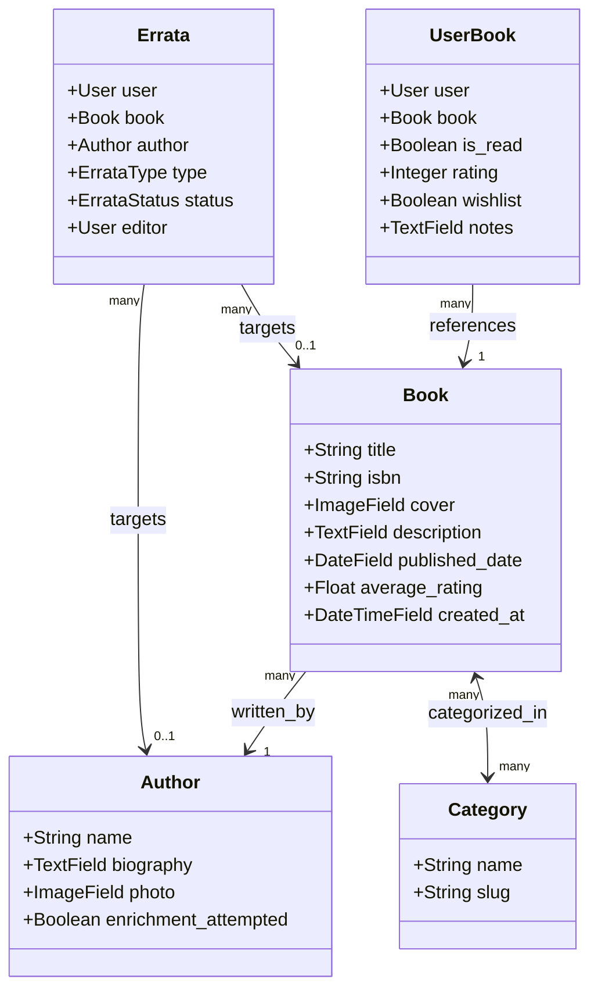
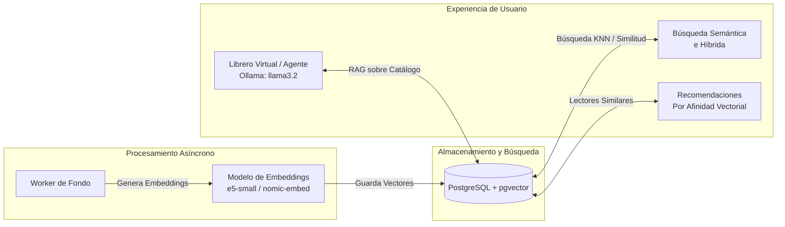

# Informe de Auditoría y Plan de Modernización — MyBookConnect

**Fecha:** 8 de septiembre de 2026  
**Rol:** Arquitecto de Software y Desarrollador Full-Stack Senior  
**Repositorio:** [MyBookConnect](file:///c:/Users/zaton/Desktop/Escritorio/proyectos/MyBookConnect)  
**Estado General:** Requiere saneamiento del índice de Git (conflictos pendientes de confirmación) y modernización integral de dependencias, seguridad, arquitectura y capacidades de IA.

---

## Resumen Ejecutivo y Diagnóstico Global

MyBookConnect es una plataforma de red social y biblioteca virtual construida sobre Django REST Framework (backend) y React con Vite (frontend), apoyada en PostgreSQL, Redis y Daphne/Channels. Tras meses sin mantenimiento, el proyecto presenta una acumulación significativa de deuda técnica, obsolescencia de dependencias críticas y riesgos de seguridad.

```
                  ┌─────────────────────────────────────────────────────────┐
                  │                 ESTADO ACTUAL vs OBJETIVO               │
                  └─────────────────────────────────────────────────────────┘

        ACTUAL (Deuda Acumulada)                       OBJETIVO (Modernizado)
  ┌─────────────────────────────────────┐       ┌─────────────────────────────────────┐
  │ • Django 5.0 (EOL)                  │       │ • Django 5.2 LTS (o 6.1)            │
  │ • Pillow 10.0.1 (CVEs de RCE)       │       │ • Pillow 12.x + psycopg 3           │
  │ • Python-jose vulnerable sin uso    │       │ • JWT Bearer seguro + rotación      │
  │ • React 18.3 + tipos rotos Router 5 │  ───► │ • React 19 + Router 7 + TipTap      │
  │ • WebSockets con sesión (roto en SPA│       │ • WebSockets con JWT Middleware     │
  │ • Scraping síncrono en requests     │       │ • Tareas asíncronas + pgvector      │
  │ • "IA" = llamadas a Wikipedia       │       │ • Embeddings locales + Agente Ollama│
  │ • Home.tsx = placeholder vacío      │       │ • Feed social vivo + Inbox realtime │
  └─────────────────────────────────────┘       └─────────────────────────────────────┘
```

### Semáforo de Salud del Sistema

| Área | Estado | Diagnóstico Principal |
| :--- | :---: | :--- |
| **Integridad del Repositorio** | 🔴 Crítico | 14 archivos marcados como unmerged en el índice de Git (cambios fusionados pendientes de `git add` y consolidación de migraciones). Código zombie de FastAPI (`backend/app`). |
| **Seguridad y Dependencias** | 🔴 Crítico | Django 5.0 fuera de soporte (EOL). `Pillow 10.0.1` afectado por CVEs de ejecución de código. `python-jose` vulnerable e innecesario. Tokens JWT expuestos en `localStorage` y en logs de consola. |
| **Arquitectura Backend & API** | 🟡 Medio | Rutas duplicadas (`/api/v1/auth/` y `/api/v1/users/` montan la misma app). Fallo en Channels: `AuthMiddlewareStack` (sesiones) choca con el SPA que usa Bearer tokens. Enriquecimiento síncrono bloquea workers HTTP. |
| **Frontend & UI/UX** | 🟡 Medio | `Home.tsx` es una página vacía. Tipos incoherentes (`@types/react-router-dom@5.3.3` con `react-router-dom@6.22.0`). Editor `quill@1.3.7` desatendido con riesgos XSS. Múltiples clientes HTTP no unificados. |
| **Infraestructura Docker** | 🟡 Medio | `docker-compose.prod.yml` incompleto e inservible. Puertos de DB/Redis expuestos en local. Contenedor de backend corriendo como `root`. Frontend prod no optimizado. |
| **Capacidades de IA** | ⚪ Básico | Inexistente a nivel de modelos o embeddings. Actualmente es solo extracción ETL síncrona contra Google Books, Open Library, Wikidata y Wikipedia. |

---

## Paso Previo Indispensable: Saneamiento de Git y Consolidación de Dominio

Antes de actualizar cualquier paquete o refactorizar servicios, el repositorio debe quedar en un estado limpio, consistente y compilable.

### Conflicto de Funcionalidades entre Ramas
El repositorio fusionó dos líneas de desarrollo que deben coexistir de forma armónica:
1. **Línea A (Social & Recomendaciones):** `blocked_users`, lógica de bloqueo/desbloqueo, filtrado de recomendaciones por categoría y actualización de libros por autor.
2. **Línea B (Comunidad & Chat):** Rol `is_editor`, sistema de `Errata` (correcciones bibliográficas), chat en tiempo real con `messages_app` y Channels, y rutas de usuario `/users/:userId` y `/friends`.

### Acciones del Paso Previo:
- Validar y registrar la resolución de los 14 archivos en conflicto en Git (`backend/books/`, `backend/users/`, `frontend/src/`).
- Eliminar carpetas residuales y código muerto:
  - `backend/app/` y `backend/config/`: Restos de un prototipo abandonado de FastAPI/SQLAlchemy.
  - `backend/messages/`: Carpeta huérfana con solo `apps.py` (la app oficial y migrada es `backend/messages_app/`).
- Generar una cadena de migraciones limpia y unificada para `books` y `users`.
- Ignorar archivos de medios en Git (`backend/media/`) y retirar del índice las portadas commiteadas accidentalmente.

---

## Fase 1: Auditoría de Dependencias y Seguridad

### 1.1 Backend (`backend/requirements.txt` y Runtime)

| Paquete | Versión Actual | Estado / Vulnerabilidad | Versión Propuesta | Justificación y Notas Técnicas |
| :--- | :---: | :---: | :---: | :--- |
| **Python** (Runtime Docker) | 3.11-slim | Obsoleto para Django 6 | **3.12-slim** o **3.13-slim** | Django 5.2 LTS soporta Python 3.10-3.13. Django 6.x requiere ≥ 3.12. |
| `Django` | 5.0 | 🔴 **EOL (Fin de ciclo)** | **5.2.x LTS** (o 6.1) | Django 5.0 no recibe parches de seguridad desde abril 2025. Django 5.2 LTS garantiza soporte hasta 2028. |
| `djangorestframework` | 3.14.0 | 🟡 Obsoleto | **3.18.0** | Compatible con Django 5.2 y 6.x. Resuelve incompatibilidades con nuevos tipos de Django. |
| `Pillow` | 10.0.1 | 🔴 **Vulnerabilidades Graves** | **11.1.x** / **12.x** | CVE-2024-28219 (Buffer overflow en `ImageDraw.floodfill`), CVE-2023-50447 y otros fallos de denegación/RCE. |
| `python-jose[cryptography]` | 3.3.0 | 🔴 **Vulnerable / Código Muerto** | **ELIMINAR** | CVE-2024-29370 (DoS por JWE). Innecesario: la autenticación la gestiona `djangorestframework-simplejwt` mediante `PyJWT`. |
| `djangorestframework-simplejwt`| 5.3.1 | 🟡 Desfasado | **5.5.x** | Mejoras en validación de tokens y compatibilidad con DRF 3.18. |
| `django-cors-headers` | 4.3.0 | 🟢 Estable | **4.7.x** | Actualización menor de mantenimiento. |
| `psycopg2-binary` | 2.9.9 | 🟡 Driver legacy | **psycopg[binary] (v3.2.x)** | Driver oficial moderno de PostgreSQL con soporte async nativo y mejor manejo de pools de conexión. |
| `requests` | 2.32.3 | 🟡 Síncrono | **httpx (0.28.x)** | Soporte nativo para I/O asíncrono (`async`/`await`), HTTP/2 y configuración estricta de timeouts. |
| `channels` / `channels-redis` | 4.3.2 / 4.3.0 | 🟢 Funcional | Fijar versiones exactas | Asegurar compatibilidad con el event-loop de Python 3.12/3.13. |
| `daphne` | 4.2.1 | 🟢 Funcional | Fijar versiones exactas | Servidor ASGI para HTTP y WebSockets. |
| *(Nuevo)* `drf-spectacular` | — | ⚪ Ausente | **0.28.x** | Generación automatizada de OpenAPI 3.0 / Swagger para documentar la API y tipar el frontend. |
| *(Nuevo)* `django-filter` | — | ⚪ Ausente | **25.x** | Filtrado declarativo en querysets (por autor, categoría, rango de fechas). |

---

### 1.2 Frontend (`frontend/package.json` y Tooling)

| Paquete | Versión Actual | Estado / Vulnerabilidad | Versión Propuesta | Justificación y Notas Técnicas |
| :--- | :---: | :---: | :---: | :--- |
| **Node.js** (Entorno) | 20-alpine | Estable | **22-alpine LTS** | Soporte extendido activo y mejor rendimiento en runtime. |
| **pnpm** (Gestor) | 8.15.4 | Desfasado | **9.x / 10.x** | Mejor resolución de dependencias y compatibilidad con lockfile v9. |
| `react` / `react-dom` | 18.3.1 | Estable (1 versión atrás) | **18.3.1 ➔ 19.x** (por fases) | Mantener 18.3.1 durante la limpieza estructural; migrar a React 19 tras estabilizar dependencias. |
| `vite` | 5.2.0 | Desactualizado | **6.x** | Tiempos de build más rápidos, ESM optimizado y entorno de desarrollo más ágil. |
| `react-router-dom` | 6.22.0 | Incoherencia de tipos | **6.28.x** o **7.x** | `@types/react-router-dom: 5.3.3` genera errores de TypeScript al mezclar APIs de v5 y v6. |
| `react-quill` + `quill` | 2.0.0 / 1.3.7 | 🔴 **Crítico / Inseguro** | **@tiptap/react** | `quill@1.3.7` está abandonado y presenta vulnerabilidades XSS conocidas. TipTap ofrece un editor moderno, seguro y altamente personalizable. |
| `axios` | 1.7.2 | ⚪ **Código Muerto** | **ELIMINAR** | Todo el frontend utiliza `fetch`. Axios ocupa peso en el bundle sin ninguna utilidad. |
| `flowbite` / `flowbite-react` | 2.3.0 / 0.7.0 | Muy desfasado | **Evaluar reemplazo** | Componentes estilizados con Tailwind puro y Lucide Icons para eliminar acoplamiento rígido a Flowbite. |
| `zustand` | 5.0.8 | 🟢 Excelente | **5.0.x** | Mantener como gestor de estado ligero. |
| *(Nuevo)* `@tanstack/react-query`| — | ⚪ Ausente | **v5** | Manejo profesional de estado del servidor: caché, reintentos, deduplicación de requests e invalidación. |

---

### 1.3 Matriz de Riesgos de Seguridad Detectados

1. **Almacenamiento de Token JWT en `localStorage`:** La persistencia de Zustand almacena el Bearer token en `localStorage` (`auth-storage`). Si existiera cualquier inyección de script (XSS), la sesión queda comprometida. *(Mitigación: uso de cookies HttpOnly o almacenamiento en memoria con rotación transparente).*
2. **Exposición de Credenciales en Logs:** El cliente `api.ts` y el store `auth.ts` emiten `console.log('Token obtenido:', token)`, exponiendo secretos en las herramientas de desarrollo del navegador.
3. **Falta de Validación SSRF en Descargas de Portadas:** `services.py` descarga imágenes desde URLs arbitrarias (`requests.get(url)`) sin comprobar si el host destino apunta a redes privadas o metadatos de nube (`169.254.169.254`).
4. **Desconexión en Autenticación WebSocket:** `channels.auth.AuthMiddlewareStack` no interpreta cabeceras `Authorization: Bearer <token>`, dejando el canal de mensajería sin acceso autenticado para los usuarios de la SPA.

---

## Fase 2: Refactorización y Arquitectura

### 2.1 Modelos de Django y Base de Datos



#### Problemas Detectados y Propuestas de Mejora:
1. **Uso de `datetime.utcnow`:** En `Book.created_at` se emplea `datetime.utcnow`, marcado como deprecado en Python 3.12+ por generar fechas sin zona horaria (naive). **Solución:** Reemplazar por `auto_now_add=True` o `django.utils.timezone.now`.
2. **Reemplazo de `unique_together` por `UniqueConstraint`:** `UserBook` y otros modelos usan la sintaxis antigua. **Solución:** Declarar `models.UniqueConstraint(fields=['user', 'book'], name='unique_user_book')` con mejor soporte para índices condicionales.
3. **Duplicación de Reseñas y Señales Recursivas:** Existe un modelo `Review` y campos `rating`/`notes` dentro de `UserBook` sincronizados mediante señales `post_save`. Esto desencadena recálculos pesados de `average_rating` llamando a `book.save()` completo. **Solución:** Simplificar el modelo de datos unificando la reseña en `UserBook` o usar `update_fields=['average_rating']` de forma estricta sin disparar señales encadenadas.
4. **Validación de Calificaciones:** Los campos `rating` admiten enteros libres. **Solución:** Aplicar `MinValueValidator(1)` y `MaxValueValidator(10)`.
5. **Relación Autor-Libro:** Actualmente un libro solo puede tener un autor (`ForeignKey`). **Solución:** Proyectar migración hacia `ManyToManyField` para admitir coautorías, manteniendo compatibilidad hacia atrás.

---

### 2.2 API REST y Capa de Servicios

```
                              DISEÑO DE API REFACTORIZADO
 ┌───────────────────────────────┐          ┌───────────────────────────────────┐
 │   Rutas Actuales (Caóticas)   │          │   Rutas Propuestas (Estandarizadas)│
 ├───────────────────────────────┤          ├───────────────────────────────────┤
 │ /api/v1/books/books/          │   ────►  │ /api/v1/books/                    │
 │ /api/v1/books/books/import/   │   ────►  │ /api/v1/books/import/             │
 │ /api/v1/books/user/books/     │   ────►  │ /api/v1/library/ (o /user-books/) │
 │ /api/v1/auth/conversations/   │   ────►  │ /api/v1/messages/conversations/   │
 │ /api/v1/users/conversations/  │   ────►  │ (Ruta duplicada eliminada)        │
 └───────────────────────────────┘          └───────────────────────────────────┘
```

1. **Normalización del Enrutamiento:**
   - Desacoplar `users.urls` de `auth/`. Dejar `/api/v1/auth/` exclusivamente para autenticación (`token/`, `register/`, `refresh/`).
   - Mover la gestión de perfiles y seguimiento a `/api/v1/users/`.
   - Reestructurar `books.urls` con `DefaultRouter` eliminando la duplicación `/books/books/`.
2. **Middleware JWT para WebSockets:**
   - Implementar `JwtAuthMiddleware` en Channels para leer el token Bearer desde el query param `?token=` o headers durante el handshake del WebSocket.
3. **Desacoplamiento del Enriquecimiento de Datos:**
   - Actualmente, las peticiones `GET` a libros y autores realizan peticiones HTTP síncronas a Wikipedia y Open Library con timeouts de hasta 15 segundos.
   - **Solución:** Retornar de inmediato la información disponible en base de datos y delegar el enriquecimiento externo a tareas asíncronas en segundo plano (vía Django background tasks / Celery).

---

### 2.3 Frontend React y Estado de la Aplicación

1. **Cliente HTTP Centralizado (`src/api/client.ts`):**
   - Reemplazar las instancias dispersas de `fetch` y `authApi` por un único cliente tipado.
   - Configurar interceptores de error: ante una respuesta `401 Unauthorized`, intentar de forma transparente el refresco del token contra `/api/v1/auth/token/refresh/` antes de invalidar la sesión.
2. **Adopción de TanStack Query (React Query v5):**
   - Mover el fetching de libros, biblioteca, perfil y amigos fuera de los `useEffect` locales hacia hooks de TanStack Query (`useQuery`, `useMutation`).
   - Ventajas: Caché automática en memoria, revalidación al reenfocar la ventana y eliminación completa de renders infinitos.
3. **Reemplazo del Editor Enriquecido:**
   - Sustituir `react-quill` y `quill@1.3.7` por `@tiptap/react` con extensiones mínimas seguras (negrita, cursiva, listas, citas), integrado limpiamente con Tailwind CSS.
4. **Limpieza de Páginas Duplicadas:**
   - Eliminar componentes duplicados como `EditProfile` presente en `src/components/` y `src/pages/`.

---

### 2.4 Infraestructura Docker y Contenedores

#### Dockerfile Backend
- **Multi-Stage Real:** Separar etapa `builder` (compilación de ruedas de Python y dependencias de compilación) de la imagen `runner` final.
- **Principio de Menor Privilegio:** Crear usuario no privilegiado (`appuser`, UID 1000) en lugar de ejecutar como `root`.
- **Healthcheck:** Incorporar comando de comprobación de salud (`curl -f http://localhost:8000/api/v1/health/ || exit 1`).
- **Archivo `.dockerignore`:** Excluir `.env`, tests, caché de Python y directorio `media/`.

#### Dockerfile Frontend
- **Optimización de Build:** Etapa 1: `node:22-alpine` para instalar dependencias y generar el bundle Vite (`pnpm build`). Etapa 2: `nginx:1.27-alpine` ligera conteniendo únicamente los archivos estáticos de `/dist`.
- **Configuración de Nginx (`nginx.conf`):** Añadir regla `try_files $uri $uri/ /index.html;` para que React Router funcione al recargar cualquier ruta directa.

#### Docker Compose
- **docker-compose.yml (Desarrollo):** Añadir `healthcheck` en Postgres y Redis; usar `depends_on: condition: service_healthy` para que Django no intente conectar antes de que la base de datos esté lista. Cerrar puertos públicos innecesarios (5432 y 6379 no requieren exposición al host).
- **docker-compose.prod.yml (Producción):** Rehacer completamente el archivo incorporando servicios de base de datos con volúmenes persistentes, redes aisladas, variables de entorno por `env_file` y proxy inverso.

---

## Fase 3: Mejoras de IA y Experiencia de Usuario (UX Social)

### 3.1 Arquitectura de Inteligencia Artificial Moderna

Actualmente, el sistema no cuenta con ninguna tecnología de IA; realiza únicamente web scraping síncrono. Se propone una arquitectura progresiva, local y soberana (sin dependencias forzadas de APIs comerciales caras):



1. **Capa Vectorial Nativa (`pgvector`):**
   - Habilitar la extensión `pgvector` en la imagen de PostgreSQL (`pgvector/pgvector:pg16`).
   - Añadir un campo `VectorField` en el modelo `Book` para almacenar el vector semántico del título, sinopsis y categorías.
2. **Generación de Embeddings Multilingües:**
   - Integrar un modelo ligero y eficiente especializado en español/inglés (`intfloat/multilingual-e5-small` o `nomic-embed-text`).
   - Generación asíncrona: al registrar o importar un libro, una tarea genera y persiste su vector sin retrasar la respuesta al usuario.
3. **Búsqueda Semántica e Híbrida:**
   - Permitir búsquedas contextuales: *"historias de intriga en la campiña inglesa"* encontrará novelas acordes aunque las palabras exactas no coincidan con el título.
   - Búsqueda híbrida combinando PostgreSQL Full-Text Search (trigramas) con similitud de coseno (`<=>`) de `pgvector`.
4. **Agente de Biblioteca Local (Asistente "Librero Virtual"):**
   - Integración con **Ollama** (`llama3.2:3b` o `qwen2.5:3b`) corriendo en un contenedor dedicado o endpoint externo compatible con OpenAI.
   - **Casos de Uso del Agente:**
     - **Recomendador Conversacional:** Asistente interactivo en la barra lateral que sugiere lecturas analizando la biblioteca del usuario.
     - **Resumen Inteligente de Opiniones:** Síntesis automática de los puntos fuertes y débiles de un libro basándose en las reseñas de la comunidad.
     - **Copiloto de Erratas:** Evaluación automática de las sugerencias de erratas para asistir al rol de editor en la validación de cambios.

---

### 3.2 Transformación de la Experiencia de Usuario (UX Social)

1. **Home Feed Social Dinámico:**
   - Rediseño completo de `Home.tsx`. Convertir el actual placeholder en un feed cronológico con:
     - Libros que tus amigos han empezado o terminado de leer.
     - Reseñas recientes y calificaciones compartidas.
     - Estantería comunitaria de libros en tendencia.
2. **Módulo de Mensajería e Inbox en Tiempo Real:**
   - Indicador visual con contador de mensajes no leídos en el Navbar.
   - Panel de chat deslizable o página dedicada `/inbox` conectada vía WebSocket (con autenticación JWT).
   - Prevención de interacciones no deseadas respetando automáticamente la lista de usuarios bloqueados (`blocked_users`).
3. **Métrica de Afinidad Lectora ("Reading Match"):**
   - Al visitar el perfil de otro usuario (`/users/:userId`), mostrar el porcentaje de afinidad basado en libros y autores compartidos, destacando *"Libros que ambos habéis leído y valorado positivamente"*.
4. **Búsqueda Global Omnibox:**
   - Barra de búsqueda central en el encabezado con dropdown interactivo segmentado en: **Libros**, **Autores** y **Lectores**.
5. **Panel de Gestión de Erratas para Editores:**
   - Interfaz dedicada para usuarios con `is_editor = true`, permitiendo filtrar erratas abiertas, comparar la versión actual con la propuesta y aprobar cambios con un solo clic.
6. **Onboarding de Nuevos Lectores:**
   - Modal inicial tras el registro para seleccionar 3 géneros favoritos y marcar 3 libros ya leídos, evitando la pantalla en blanco inicial y sembrando el feed social.

---

## Hoja de Ruta de Implementación Propuesta (Paso a Paso)

Para garantizar estabilidad total y cero regresiones, los cambios se ejecutarán en sprints secuenciales:

| Fase | Tarea Principal | Acciones Concretas | Criterio de Aceptación |
| :---: | :--- | :--- | :--- |
| **0** | **Saneamiento del Repositorio** | Confirmar resoluciones de merge en Git; eliminar código zombie (`backend/app`, `backend/config`); normalizar `.gitignore`. | Repositorio limpio; `git status` sin unmerged paths; arranque local sin errores. |
| **1A** | **Higiene y Dependencias Backend** | Eliminar `python-jose`; actualizar `Pillow 11.x`, `Django 5.2 LTS`, `DRF 3.18`; incorporar `drf-spectacular`. | Suite de migraciones aplicada; endpoints básicos respondiendo; documentación OpenAPI accesible. |
| **1B** | **Modernización Frontend Base** | Eliminar `axios`; corregir tipos de React Router; actualizar Vite 6; sustituir `react-quill` por TipTap. | Compilación `pnpm build` sin errores de tipos; editor de texto operativo. |
| **2A** | **Refactorización de Arquitectura Backend** | Desacoplar URLs; implementar `JwtAuthMiddleware` en Channels; migrar llamadas síncronas de servicios a tareas desacopladas. | Chat WebSocket autenticado mediante JWT; carga de ficha de libro en < 200 ms. |
| **2B** | **Refactorización de Arquitectura Frontend** | Crear `client.ts` unificado con auto-refresh de JWT; integrar TanStack Query en Library y BookDetail. | Cero llamadas `fetch` redundantes; revalidación automática de estado. |
| **2C** | **Endurecimiento de Docker** | Multi-stage en Dockerfiles; usuario no-root; healthchecks en Compose; rehacer `docker-compose.prod.yml`. | Contenedores arrancan ordenadamente comprobando dependencias saludables. |
| **3A** | **UX Social (Home, Chat, Match)** | Desarrollar Feed de Home; crear componente de Inbox con badge en Header; añadir sección de afinidad en perfiles. | Usuario interactúa con un muro social funcional y chatea en tiempo real. |
| **3B** | **Integración de IA (pgvector & Ollama)** | Habilitar extensión `pgvector`; generar embeddings de catálogo; endpoint de búsqueda semántica y asistente de lectura. | Búsqueda por lenguaje natural operativa en catálogo y recomendaciones por similitud. |

---

## Preguntas y Decisiones para el Usuario

> [!IMPORTANT]
> Antes de proceder con la ejecución del **Paso 0** y fases posteriores, por favor confirma las siguientes decisiones técnicas:

1. **Versión de Django:** ¿Prefieres **Django 5.2 LTS** (máxima estabilidad garantizada hasta 2028 y soporte pleno de ecosistema actual) o saltar directamente a **Django 6.1**? *(Recomendación: Django 5.2 LTS en primera instancia y luego evaluar 6.1 tras estabilizar el stack).*
2. **Motor de IA Local:** Para la Fase 3, ¿dispones de un entorno con soporte para **Ollama** (GPU/CPU local) para levantar modelos como `llama3.2` o prefieres que la integración admita también proveedores cloud compatibles con la API de OpenAI?
3. **Flujo de Ejecución:** ¿Confirmas comenzar de inmediato por el **Paso 0 (saneamiento de Git, eliminación de código zombie y unificación de migraciones)** para tener una base 100% estable sobre la que aplicar las dependencias de la Fase 1?
